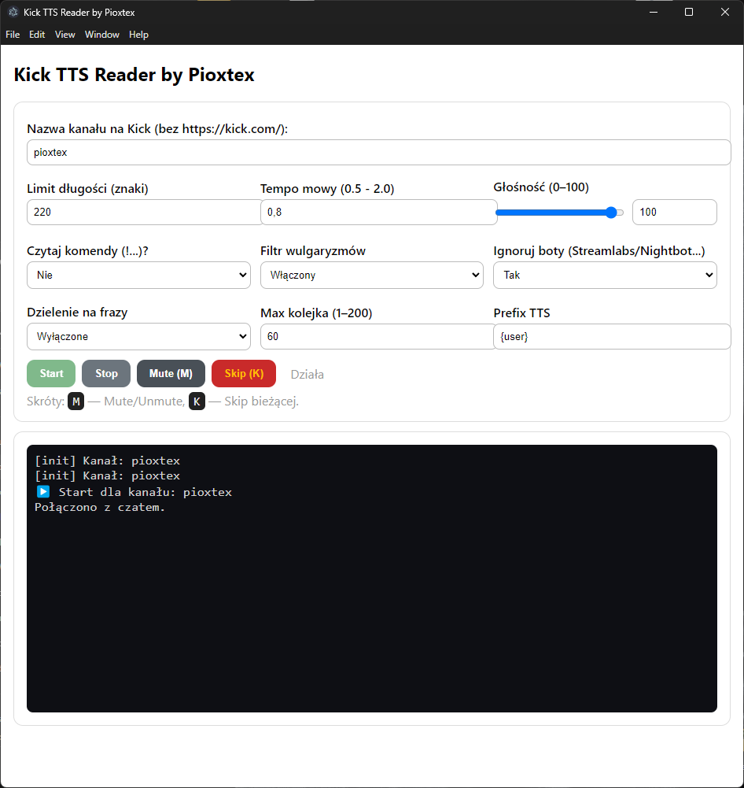

# 🎤 Kick TTS Reader ~ Chat-to-Speech for Kick.com

**Kick TTS Reader** to bot autorstwa **Pioxtex**, który przekształca wiadomości z czatu [Kick.com](https://kick.com) na mowę przy użyciu głosu systemowego Windows (SAPI/Iwona).  
Działa w środowisku **Electron**, posiada kolejkę FIFO, możliwość wyciszania, pomijania.

---

## 🚀 Funkcje

- 🎧 Czytanie wiadomości z czatu Kick.com w czasie rzeczywistym  
- 🔄 Kolejka FIFO – czyta wiadomości **jedna po drugiej**, bez chaosu  
- 🛑 Mute / Unmute (`M`) – natychmiastowe wstrzymanie/wznowienie  
- ⏭️ Skip (`K`) – pominięcie aktualnej wiadomości  
- 🧹 Filtr wulgaryzmów (włącz/wyłącz)  
- ⚙️ Ustawienia: tempo, głośność, dzielenie na frazy, max kolejka  
- 🤖 Ignorowanie botów (Streamlabs, Nightbot, Moobot)  
- 🔤 Prefix tekstu (np. `{user} napisał:`)  
- 💬 Pomijanie komend (np. `!play`, `!song`)

---

## 🪟 Wymagania

- Windows 10 / 11  
- Node.js v18+  
- Połączenie z Internetem

---

## ⚡ Instalacja

```bash
git clone https://github.com/Pioxtex/Kick_TTS_Reader.git
cd Kick-TTS-Reader\Bot_TTS_Kick_console
npm install
npm run start
```

Po uruchomieniu:
1. Wpisz nazwę kanału Kick (np. `pioxtex`),
2. Kliknij **Start**,
3. Ciesz się automatycznym czytaniem czatu.

---

## 🧩 Skróty klawiszowe

| Klawisz | Akcja |
|:-------:|:------|
| **M** | Wycisz / Wznów |
| **K** | Pominięcie bieżącej wiadomości |

---

## 🧠 Architektura

```
src/
 ├─ main.js         → proces główny Electron
 ├─ preload.cjs     → mostek IPC między renderem a mainem
 ├─ renderer.html   → GUI
 └─ ttsBot.js       → logika TTS i czatu
```

---

## 🖼️ Zrzut ekranu



---

## 🧑‍💻 Autor

**Pioxtex**  
> pasjonat informatyki, dźwięku i automatyzacji  
> [Kick.com/pioxtex](https://kick.com/pioxtex)

---

## 🪪 Licencja

Projekt udostępniony na licencji **MIT**.  
Można go używać, modyfikować i rozpowszechniać z zachowaniem informacji o autorze.

---

> *„Mów do mnie jak do człowieka — Kick TTS Reader by Pioxtex.”*
